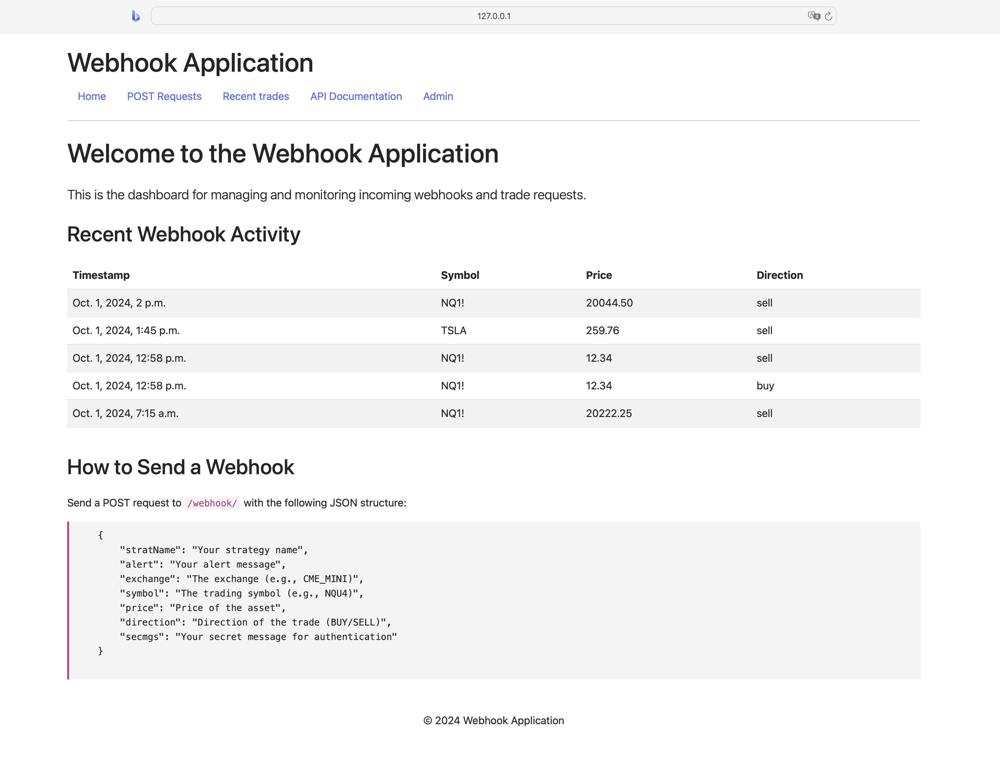
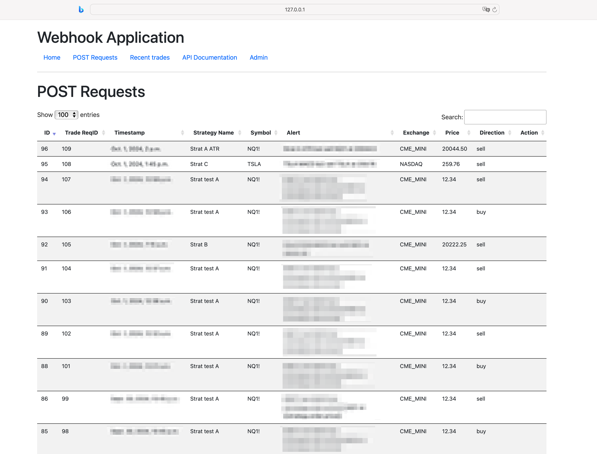
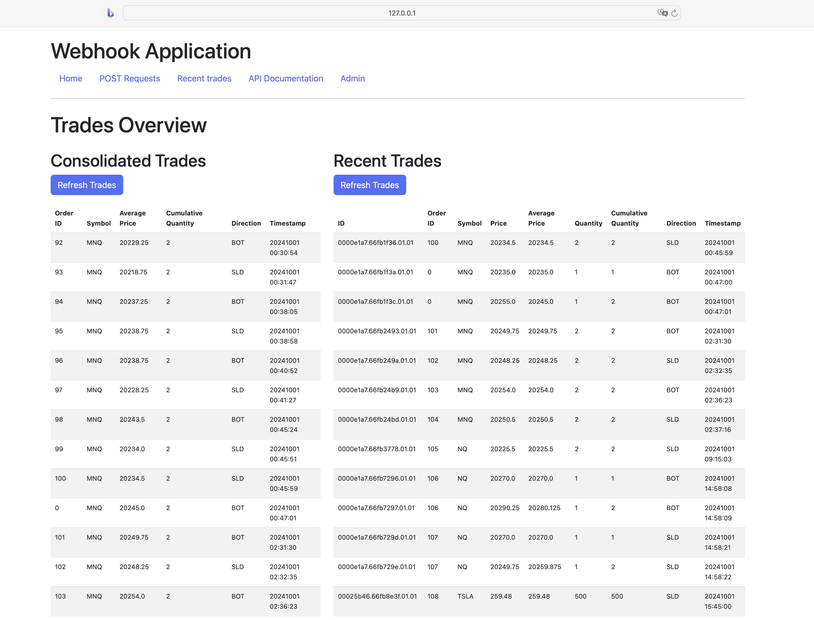
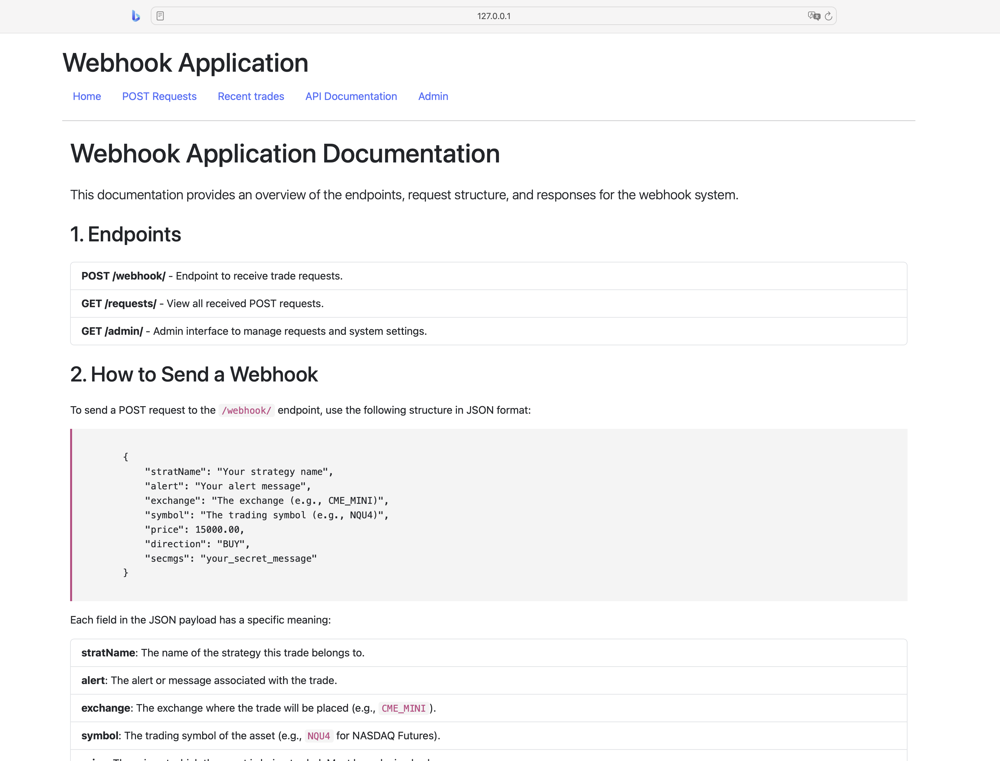
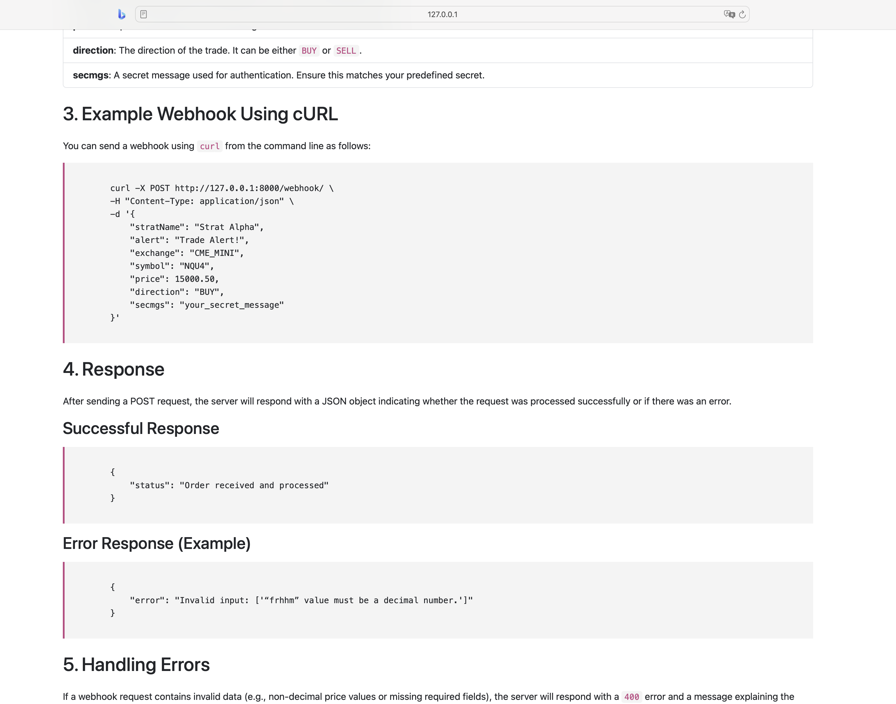

# Webhook-Driven Trade Monitoring Application

This application is a **Django-based web platform** designed to monitor, log, and manage real-time trade execution data using the **Interactive Brokers API (IBAPI)**. The app listens for **POST requests** from external sources like **TradingView** to execute trades and displays live updates on executed trades and trade requests. 

Key features include the ability to handle multiple webhook requests, track recent trades, display consolidated trade information, and offer a user-friendly interface for viewing and interacting with trade data.

## Key Features

#### 1. Webhook Listener
- The app listens for POST requests on the `/webhook/` endpoint, which triggers trade execution based on the data received. Each request includes trade details like strategy name, symbol, price, direction (buy/sell), and more.
- The app uses **IBAPI** to interact with Interactive Brokers, placing trades directly when the webhook triggers.
- Incoming trade requests are logged in a database, capturing details like the trade symbol, price, direction, and the time it was received.

#### 2. Real-Time Trade Monitoring
- The app displays both raw and **consolidated trades** using real-time data fetched from **Interactive Brokers**.
- Trade data is fetched using IBAPI’s `execDetails` callback function, which captures each execution and logs it in memory for display.

#### 3. Consolidated and Recent Trades
- **Recent Trades**: Displays the latest trades received from IBAPI, including details such as `Order ID`, `Symbol`, `Price`, `Average Price`, `Quantity`, `Cumulative Quantity`, `Direction`, and `Timestamp`.
- **Consolidated Trades**: Consolidates trades based on `Order ID`. If multiple executions share the same `Order ID`, they are grouped, and the row with the maximum `Cumulative Quantity` is displayed, omitting individual prices and quantities.

#### 4. Endpoints

- **`/webhook/`**: The endpoint for receiving POST requests to execute trades. The webhook includes parameters like `stratName`, `symbol`, `price`, `direction`, etc.
- **`/trades/`**: Displays the most recent 20 trades and a consolidated trade summary in two side-by-side tables. A refresh button updates the trades in real-time.
- **`/admin/`**: Django’s built-in admin interface for managing trade requests and other app configurations.
- **`/documentation/`**: Provides detailed documentation on how to interact with the webhook API, including example payloads.

## Screenshots

### Homepage

### Post Requests page

### Trades page

### Documentation page

